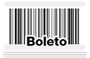
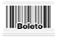
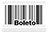
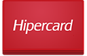
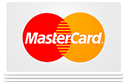

# Credit Card Icon Set BR

*Este recurso foi criado por Dani Guerrato para blog.popupdesign.com.br*

---

128px | 64px | 48px
----- | ---- | ----
 |  | 
 |  | 
 |  | 
 |  | 
 |  | 
 |  | 
 |  | 
 |  | 
 |  | 
 |  | 
 |  | 
 |  | 
 |  | 
 |  | 
 |  | 
 |  | 
 |  | 
 |  | 
 |  | 
 |  | 

---

## Termos De Uso

Este recurso é livre para uso tanto pessoal como comercial. A atribuição de crédito não é obrigatória, mas é muito apreciada!

Você não possui a permissão para disponibilizar ou redistribuir estes arquivos em qualquer outro lugar sem o consentimento de seus criadores. A venda destes arquivos é terminantemente proibida.

---

## Créditos

**Dani Guerrato**

[www.blog.popupdesign.com.br](http://www.blog.popupdesign.com.br)

[www.popupdesign.com.br](http://www.popupdesign.com.br)
